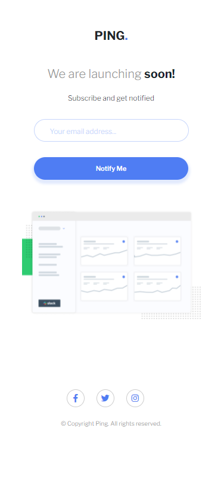
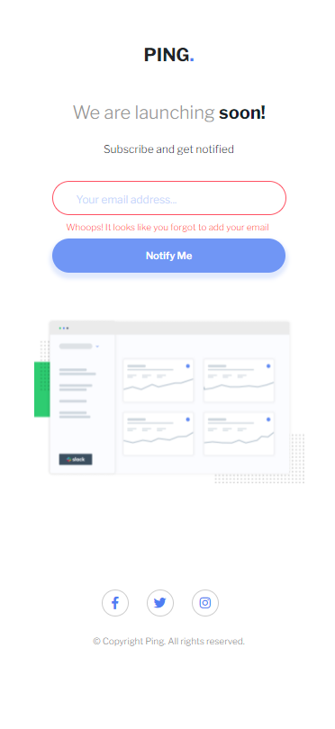

# Frontend Mentor - Ping coming soon page solution

This is a solution to the [Ping coming soon page challenge on Frontend Mentor](https://www.frontendmentor.io/challenges/ping-single-column-coming-soon-page-5cadd051fec04111f7b848da). Frontend Mentor challenges help you improve your coding skills by building realistic projects.

## Table of contents

- [Overview](#overview)
  - [The challenge](#the-challenge)
  - [Screenshot](#screenshot)
  - [Links](#links)
- [My process](#my-process)
  - [Built with](#built-with)
  - [What I learned](#what-i-learned)
  - [Continued development](#continued-development)
  - [Useful resources](#useful-resources)
- [Author](#author)

## Overview

### The challenge

Users should be able to:

- View the optimal layout for the site depending on their device's screen size
- See hover states for all interactive elements on the page
- Submit their email address using an `input` field
- Receive an error message when the `form` is submitted if:
  - The `input` field is empty. The message for this error should say _"Whoops! It looks like you forgot to add your email"_
  - The email address is not formatted correctly (i.e. a correct email address should have this structure: `name@host.tld`). The message for this error should say _"Please provide a valid email address"_

### Screenshot





### Links

- Solution URL: [https://www.frontendmentor.io/solutions/ping-single-column-coming-soon-page-MPMKAQusK]
- Live Site URL: [https://coming-soon-page-jajamaru14.vercel.app/]

## My process

### Built with

- Semantic HTML5 markup
- CSS custom properties
- Flexbox
- Vanilla JS

### What I learned

This was the very first project I've built using js by myself!
Preventing the default form submission behavior was something that took me a while to figure out and get it working. Some of the CSS styles are still repetitive and can be refactored.

```js
function alertMsg(e) {
  e.preventDefault();

  if (emailInput.value.match(regex)) {
    alertP.textContent = 'Thanks for signing up!';
    alertStyle('hsl(223, 87%, 63%)', 600);
  } else if (emailInput.value === '') {
    alertP.textContent = 'Whoops! It looks like you forgot to add your email';
    alertStyle('hsl(354, 100%, 66%)', 400);
  } else {
    alertP.textContent = 'Please provide a valid email address';
    alertStyle('hsl(354, 100%, 66%)', 400);
  }
}
```

### Continued development

I still need to work on my JS skill a lot more and also need to get comfortable with CSS Flexbox and CSS Grid. Positioning an element is also tough for me at times. I will keep building more projects to solidify fundametals.

### Useful resources

- [Example resource 1](https://developer.mozilla.org/ja/docs/Web/API/HTMLFormElement/submit_event) - This helped me for preventing default form submission behavior.

- [Example resource 2](https://www.javadrive.jp/regex-basic/sample/index13.html) - This is an amazing article which helped me to get my regex right. I'd recommend it to anyone still learning this concept.

## Author

- codepen - [@JaJamaRu](https://codepen.io/JaJamaRu)
- Frontend Mentor - [@JaJamaRu14](https://www.frontendmentor.io/profile/JaJamaRu14)
- Twitter - [@shotime_14](https://twitter.com/shotime_14)
